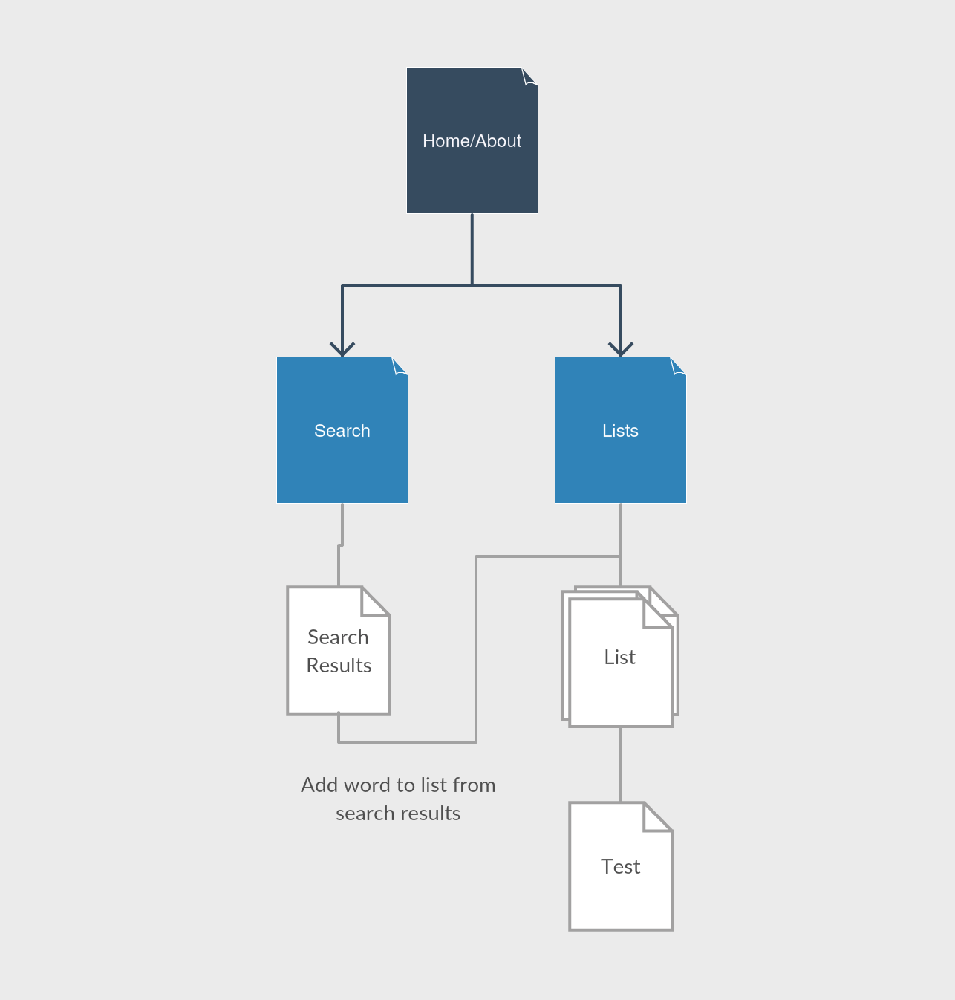

# JStudy

## Overview

Studying for a foreign language is difficult as is. When a foreign language uses completely different symbols than what you're used to makes it all the more difficult. JStudy aids your study of Japanese by providing a web application that allows you to maintain study lists of Japanese words to help you organize your studying. When you feel the need to test yourself, the lists will turn into flashcards.


## Data Model

In terms of data, we'll need to store the user, the word list, and the individual words. Each user can have multiple lists (i.e. "Chapter 1 List," "Cultural Words," etc), and each list can contain multiple words. These words will be Japanese kanji/kana and will be pulled from an online dictionary of Japanese words.

First draft schema:

```javascript
//The User
// - each user has a username and password that they set up upon registration
// - each user can have 0 or more word lists to study from
var User = new mongoose.Schema({
  //authentication provided by Passport (probably)
  wordLists:  [{ type: mongoose.Schema.Types.ObjectId, ref: 'WordList' }]
});

//A Word
// - words can be stored in a word list
// - likely use external dictionary to search for words
// - each word contains:
//   - the word itself (in Japanese)
//   - the part of speech
//   - the definition of the word
//   - any example sentences using the word
var Word = new mongoose.Schema({
	word: {type: String, required: true},
    partOfSpeech: {type: String, required: true},
    definition: {type: String, required: true},
    exampleSentences: [String]
});

//A Word List
// - word lists contain:
//   - a user associated with the list
//   - a name given to the list
//   - an array of words comprising the list
//   - time it took to finish last test (seconds?)
//   - last achieved "score" when testing using the list
// - each word list can have 0 or more words in it
var WordList = new mongoose.Schema({
    user: {type: mongoose.Schema.Types.ObjectId, ref:'User'},
    listName: {type: String, required: true},
    lastTime: {type: Number},
	lastScore: {type: Number},
	words: [Word]
});
```

## Wireframes


## Sitemap




## Use Cases

As a student, I want to add words to my study list in order to keep track of words I'm learning.

As a student, I want to be able to test myself using the words I've saved to my list.

As a user, I want to easily see what each list contains by collapsing/expanding the list.

As a student, I want to keep track of my progress in learning the words in the list in my tests through time and score.

As a user, I want to be able to easily add a word I search for to one of my lists.


## Research

Likely research topics include:
<ul>
<li>MVC</li>
<li>Automated Functional Testing</li>
<li>JSHint</li>
<li>User Authentication</li>
<li>CSS Framework Use</li>
<li>Online Japanese-English Dictionary API</li>
</ul>


# MVC

MVC stands for Model-View-Controller. It is a design pattern for implementing user interfaces that separates the logic (model) with the presentation (view) using a middleman (controller). It may be helpful to follow to design pattern in order to allow for greater extensibility later and to keep logic bugs from affecting the presentation and vice versa.

# Automated Functional Testing

Automated functional testing is a way of testing your application automatically using predefined tests that the application must pass. This automation allows the developer to always be aware of possible bugs in the code. Possible modules to use include Selenium and PhantomJS.

# User Authentication

User authentication allows for personalized accounts on web services. Each user has a username and password and their specific items on a particular web service (profile, lists, favorites, etc) can then be tied to their account. Using this in this particular web application is crucial for saving lists that users have created to study from. These lists can be retrieved by the user by simply logging into their account and checking their lists. Most likely will use Passport for this.

# CSS Framework

CSS frameworks allow for easier web design that conforms better to current web design standards. It also provides the less graphically inclined with easy to customize templates for a variety of interface components. This would save a great amount of time in comparison to making these interface elements from scratch. Most likely will use Bootstrap for this.

# Online Japanese-English Dictionary API

In order to search for words, there must be an underlying dictionary to search from. There are a great deal of dictionaries online but APIs are sparse. The most widely used dictionary is JMdict, which provides a downloadable XML version of their dictionary. It may be possible to search this XML file using Javascript each time a search is made, although I don't know whether it would take a long time to search the file. Another approach is to turn the XML file into a hash table that allows for quicker searching.

A website, Jisho.org, also maintains a beta API of their website. Although functionality is currently limited, it might be enough to get this website up and running.


## Possible Additional Features (if time permits)

<ul>
<li>Share lists with other users</li>
<li>Multiple testing methods instead of just flashcards</li>
</ul>
